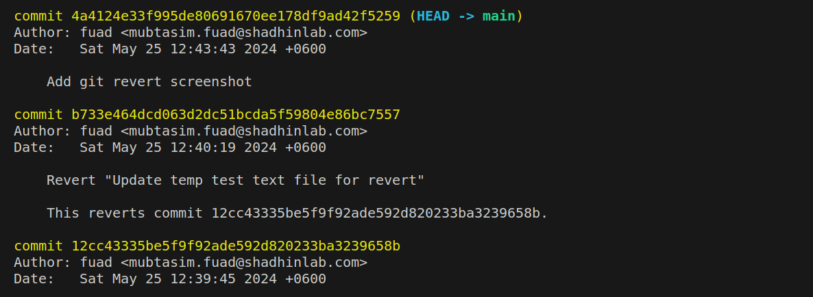
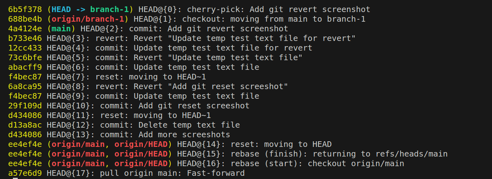
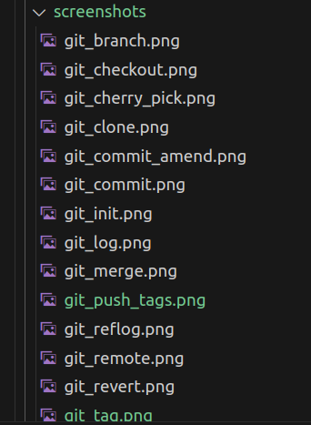

### Git Commands Scribe Sheet 

We'll walk you through the most commonly used Git commands with examples and screenshots. Let's dive in! 

## Table of Contents

1. [Getting Started](#getting-started)
2. [Branching Out](#branching-out)
3. [Committing to It](#committing-to-it)
4. [Collaborating](#collaborating)
5. [Managing Changes](#managing-changes)
6. [Exploring History](#exploring-history)
7. [Handling Remotes](#handling-remotes)
8. [Tagging](#tagging)
9. [Screenshots](#screenshots)

## Getting Started 

### `git clone`
- **Description:** Clone a repository into a new directory.
- **Example:** 
  ```bash
  git clone https://github.com/your-username/IC-repo.git
  ```
- **Screenshot:** 

### `git init`
- **Description:** Create an empty Git repository or reinitialize an existing one.
- **Example:**
  ```bash
  git init
  ```
- **Screenshot:** 

## Branching Out 

### `git branch`
- **Description:** List, create, or delete branches.
- **Example:**
  ```bash
  git branch branch-1
  git branch
  ```
- **Screenshot:** 

### `git checkout`
- **Description:** Switch branches or restore working tree files.
- **Example:**
  ```bash
  git checkout -b branch-1
  ```
- **Screenshot:** 

### `git merge`
- **Description:** Join two or more development histories together.
- **Example:**
  ```bash
  git merge branch-1
  ```
- **Screenshot:** 

## Committing to It 

### `git add`
- **Description:** Add file contents to the index (staging area).
- **Example:**
  ```bash
  git add .
  ```

### `git commit`
- **Description:** Record changes to the repository.
- **Example:**
  ```bash
  git commit -m "Add screenshot of git merge"
  ```
- **Screenshot:** 

### `git commit --amend`
- **Description:** Amend the most recent commit.
- **Example:**
  ```bash
  git commit --amend -m "Add screenshot of git merge with git commit"
  ```
- **Screenshot:** 

## Collaborating 

### `git pull`
- **Description:** Fetch from and integrate with another repository or a local branch.
- **Example:**
  ```bash
  git pull origin main
  ```
- **When to use:** Use `git pull` to update your local branch with changes from the remote repository and automatically merge them. Be cautious if you have local changes that are not committed, as it may cause conflicts.
- **Scenario:** Suppose you and your teammate are working on the same branch. Before pushing your changes, it's a good idea to `git pull` to incorporate your teammate's changes. If conflicts arise, you'll need to resolve them locally before you can push. Note: `git pull` can create an extra merge commit if there are changes in the remote branch that are not in your local branch.
- **Example Commit Message:** After resolving conflicts, you might commit with a message like:
  ```bash
  git commit -m "Resolved merge conflicts after pulling updates"
  ```
- **Screenshot:** 

### `git fetch`
- **Description:** Download objects and refs from another repository.
- **Example:**
  ```bash
  git fetch origin
  ```
- **When to use:** Use `git fetch` to see what changes are available in the remote repository without merging them into your current branch. This is useful for reviewing changes before integrating them.

### `git fetch + rebase`
- **Description:** Fetch changes from the remote repository and reapply your changes on top of the fetched changes.
- **Example:**
  ```bash
  git fetch origin
  git rebase origin/main
  ```
- **When to use:** Use `git fetch + rebase` to integrate changes from the remote repository into your current branch by replaying your local commits on top of the fetched changes. This keeps your commit history linear and clean.
- **Scenario:** If you have local changes that are not yet pushed to the remote, `rebase` helps you apply these changes on top of the latest remote changes, making it easier to push your updates.
- **Advantage:** Using `git fetch + rebase` minimizes the number of commits by avoiding the extra merge commit created by `git pull`.
- **Example Commit Message:** After rebasing and resolving any conflicts, you might need to amend your commits:
  ```bash
  git commit --amend -m "Updated commit after rebasing with remote changes"
  ```
- **Screenshot:** 

## Managing Changes 

### `git stash`
- **Description:** Stash the changes in a dirty working directory away.
- **Example:**
  ```bash
  git stash
  git stash pop
  ```
- **When to use:** Use `git stash` when you need to switch branches or pull changes without committing your current changes. This saves your uncommitted changes for later use.
- **Screenshot:** 

### `git reset`
- **Description:** Reset current HEAD to the specified state.
- **Example:**
  ```bash
  git reset --hard HEAD~1
  ```
- **When to use:** Use `git reset` to discard changes in your working directory and move back to a previous commit. Be cautious, as `--hard` will delete uncommitted changes.
- **Screenshot:** 

### `git revert`
- **Description:** Create a new commit that undoes the changes made by an earlier commit.
- **Example:**
  ```bash
  git revert <commit-hash>
  ```
- **When to use:** Use `git revert` to undo changes by creating a new commit that reverses a previous commit. This is safer than `git reset` because it preserves the history.
- **Screenshot:** 


### `git cherry-pick`
- **Description:** Apply the changes introduced by some existing commits.
- **Example:**
  ```bash
  git cherry-pick <commit-hash>
  ```
- **When to use:** Use `git cherry-pick` to apply specific commits from one branch to another. This is useful for applying bug fixes without merging entire branches.
- **Screenshot:** 

## Exploring History 

### `git log`
- **Description:** Show commit logs.
- **Example:**
  ```bash
  git log
  ```
- **When to use:** Use `git log` to view the history of commits. This is helpful for tracking changes and understanding the project history.
- **Screenshot:** 

### `git reflog`
- **Description:** Show the reference logs.
- **Example:**
  ```bash
  git reflog
  ```
- **When to use:** Use `git reflog` to see a log of all the changes made to the tips of branches and other references. This is especially useful for recovering lost commits or understanding the sequence of changes.
- **Scenario:** Git Reset vs. Git Reflog: If you accidentally reset your branch to an earlier commit and lose some work, `git reflog` can help you find the lost commit hash and recover your changes by checking out or resetting to that commit.
- **Screenshot:** 

## Handling Remotes 

### `git remote`
- **Description:** Manage set of tracked repositories.
- **Example:**
  ```bash
  git remote -v
  git remote add origin https://github.com/your-username/IC-repo.git
  ```
- **When to use:** Use `git remote` to manage remote repository connections. This is helpful for linking your local repository with remote repositories like GitHub.
- **Screenshot:** 

### `git remote remove`
- **Description:** Remove the remote repository.
- **Example:**
  ```bash
  git remote remove origin
  ```
- **When to use:** Use `git remote remove` to disconnect your local repository from a remote

 repository.

## Tagging 

### `git tag`
- **Description:** Create, list, delete or verify a tag object signed with GPG. Tags are useful for marking release points (e.g., v1.0, v2.0).
- **Example:**
  ```bash
  git tag -a v1.0 -m "Version 1.0"
  git tag
  ```
- **When to use:** Use `git tag` to create, list, or delete tags. Tags are helpful for marking specific points in your project's history, like releases.
- **Screenshot:** 

### `git push --tags`
- **Description:** Push all tags to remote repository.
- **Example:**
  ```bash
  git push --tags
  ```
- **When to use:** Use `git push --tags` to push all your local tags to the remote repository. This ensures that tags created locally are also available in the remote repository.
- **Screenshot:** 

## Screenshots 📸

All the screenshots mentioned above are located in the `screenshots` folder. Here's a preview:

- 

Happy coding! If you have any questions or suggestions, feel free to reach out. Let's make Git simpler, one command at a time! ✨

Inspired by:
- [SAIO-Ubuntu18 by rizwan192](https://github.com/rizwan192/SAIO-Ubuntu18)
- [Awesome GitHub Profile README by abhisheknaiidu](https://github.com/abhisheknaiidu/awesome-github-profile-readme?tab=readme-ov-file#github-actions)

Assignment by:
- [Mubtasim Fuad](https://github.com/mubtasimfuad)