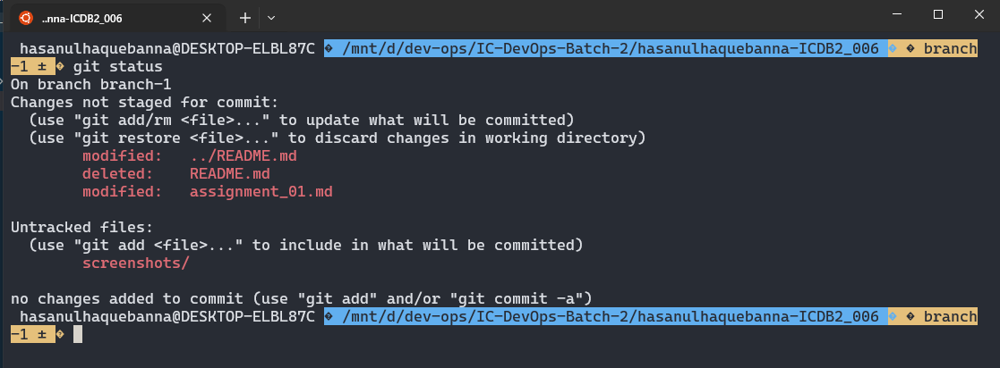
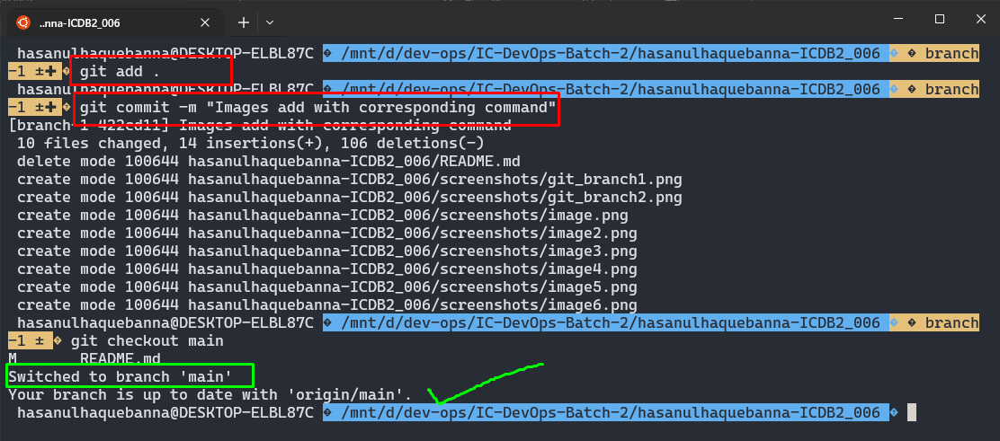

# 📝Scribe sheet of all the git commands in course

## ✒ Hasanul Haque Banna

<br/><br/>

### Command: git init

Initializes a new Git repository in the current directory

**Usage:**

```sh
git init
```

This command basically reinitializing an existing one or create a new repository
<br/> <br/>

### Command: git add .

Stages all changes in the current directory for the action of next commit

**Usage:**

```sh
git add .
```


This command bascially do stages all modified, newly created or deleted files in the current directory for the action of next commit
<br/><br/>

### Command: git add 'filename'

Stages a specific file for the action of next commit

**Usage:**

```sh
git add filename
```


This command is useful for selectively staging changes. [`Note:` Should have replace the `filename` with something `eg: 1st_assignment.txt`]
<br/><br/>

### Command: git commit -m 'message'

Records the staged changes with a descriptive message

**Usage:**

```sh
git commit -m 'message'
```


This command creates a new commit with the staged changes. [`Note:` Should have replace the `message` with something `eg: My first git commit`]
<br/> <br/>

### Command: git status

Displays the state of the working directory

**Usage:**

```sh
git status
```


This command shows that which changes have been staged, which haven’t, and which files aren’t being tracked by Git
<br/> <br/>

### Command: git branch

**Usage:**

```sh
git branch
```


This command shows manages branches in the repository.
<br/> <br/>

### Command: git log

Displays a log of commits in the repository.

**Usage:**

```sh
git log
```


This command shows the commit history, including commit hashes, authors, dates, and messages.
<br/><br/>

### Command: git checkout branch

Switches to a specified branch.

**Usage:**

```sh
git checkout branch_name
```

This command changes the current working branch to the specified branch.[`Note:` Replace the `branch_name` with descriptive branch `eg: devop_branch_1`]


In this image i faced some issue that is 'first need to commit'.

This is because I have added some image while doing changes with these command and added these pictures with corresponding command without doing any commit changes.

So on the next command i will commit again and then i can properly able to change branch like below:

<br/><br/>

### Command: git clone <repository_url>

This command creates a local copy (clone)

**Usage:**

```sh
git clone https://github.com/rizwan192/SAIO-Ubuntu18
```


Explains that this command creates a local copy (clone) of the remote repository specified by `<repository_url>` here repository url replace with `https://github.com/rizwan192/SAIO-Ubuntu18`.
<br/><br/>

### Command: git remote

This command lists all configured remote repositories

**Usage:**

```sh
git remote
```


This command shows a list of remote repositories that the local repository is configured to track.
<br/><br/>

### Command: git remote add <remote_name> <remote_url>

This command adds a new remote repository to your local repository with the name `remote_name` and the URL `remote_url`

**Usage**

```sh
git remote add banna git@github.com:programmerbanna/IC-DevOps-Batch-2.git
```


With that command i have added banna as `remote_name` and the following `remote_url`, and after run the command of `git remote` the output shows banna as a `remote_name` mentioned in the above image
